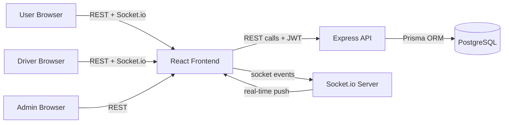
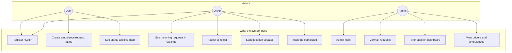
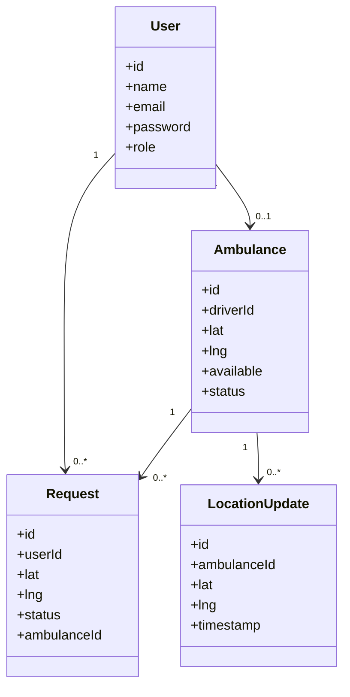
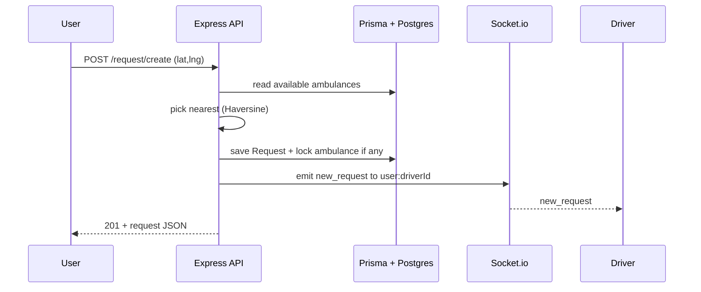
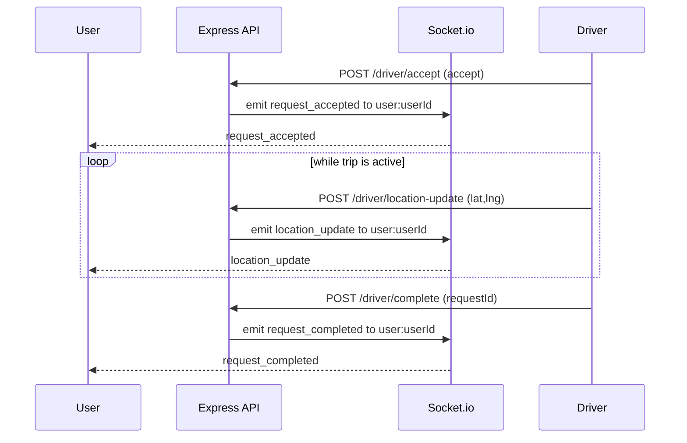
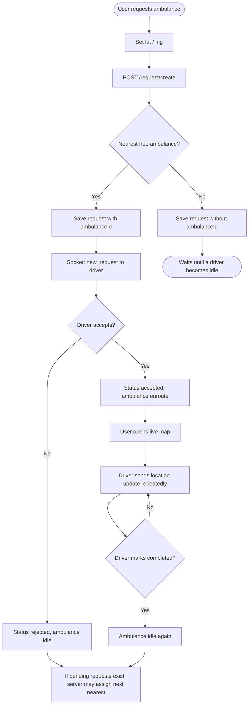
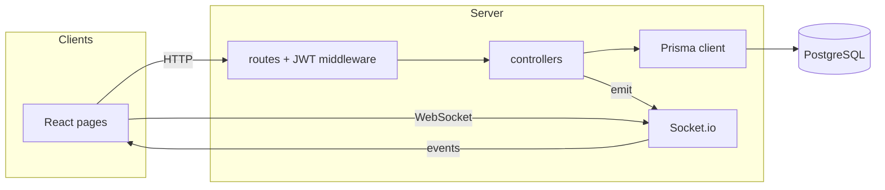
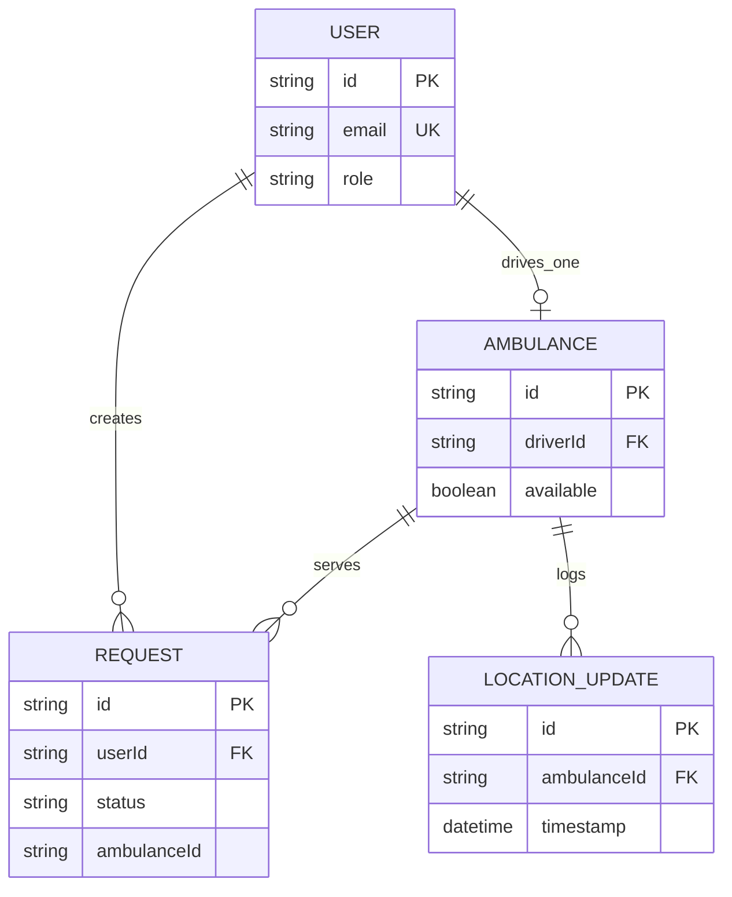

# Unified Ambulance System — Design Diagrams (Mermaid)

This file matches the **simple, readable style** used in `explanation.md`: a few nodes per diagram, clear labels, and flows that mirror the real code (`client/`, `server/`, Prisma, Socket.io).

---

## 1. System Architecture Diagram

Same structure as **Section 4** in `explanation.md`, with Prisma called out on the database link so it is obvious how data is stored.

**Explanation:**

- **What it represents:** Who talks to what at a glance: three browsers, one React app, one API, one Socket server, one database.
- **Components:** React (`client`), Express routes under `/auth`, `/request`, `/driver`, `/admin` (`server/server.js`), Socket.io (`server/sockets/index.js`), Prisma + PostgreSQL.
- **How it works:** REST carries most commands (create request, accept, location update, admin lists). Socket.io pushes `new_request`, `request_accepted`, `location_update`, and `request_completed` back to the right browser without extra polling.

---

## 2. Use Case Diagram

A compact **flowchart** (easy to render everywhere). Each box is something the code actually supports.

**Explanation:**

- **What it represents:** The three roles and the main goals tied to your pages and APIs.
- **Components:** User flows (`RegisterPage`, `LoginPage`, `RequestAmbulancePage`, `UserDashboard`, `TrackingPage`); Driver (`DriverDashboard` + `/driver/*`); Admin (`AdminLoginPage`, `AdminDashboard` + `/admin/*`).
- **How it works:** Users drive requests and tracking; drivers react and send GPS; admins read global data. Filtering by Total/Active/Completed is done in the browser on data from `GET /admin/requests`.

---

## 3. Class Diagram

Only the **four Prisma models** and how they link. Field names match `server/prisma/schema.prisma`.

**Explanation:**

- **What it represents:** The database “classes” your app persists through Prisma.
- **Components:** `User`, `Ambulance`, `Request`, `LocationUpdate`.
- **How it works:** A user places many requests over time. Each driver user has at most one ambulance. A request may have no ambulance yet (`ambulanceId` null) until dispatch assigns one. Each location ping stores one `LocationUpdate` row.

---

## 4. Sequence Diagram

Two short sequences (same ideas as **Sections 8–9** in `explanation.md`): first **create + dispatch**, then **accept + live tracking + complete**.

### 4a. Create request and notify driver

### 4b. Accept, live location, complete

**Explanation:**

- **What it represents:** The main time order of messages for dispatch and tracking.
- **Components:** User and driver UIs, `requestController` / `driverController`, Prisma, Socket.io rooms `user:<id>`.
- **How it works:** HTTP writes state; Socket.io tells the other party immediately. The tracking page (`TrackingPage.js`) listens for `location_update` and moves the map marker.

---

## 5. Activity Diagram

Straight-line story with one branch for “no ambulance free at first” and a small note for **idle reassignment** (implemented in `driverController.js`).

**Explanation:**

- **What it represents:** The life of one request from submit to finish.
- **Components:** `createRequest`, `acceptRequest`, `locationUpdate`, `completeRequest`, plus `assignPendingRequestToIdleAmbulance` after reject/complete.
- **How it works:** Happy path: assign → notify → accept → location loop → complete. If no ambulance was free, the request stays unassigned until an ambulance goes idle and the server assigns the closest waiting `pending` request.

---

## 6. Collaboration Diagram

Who sends messages to whom (objects / layers), kept flat like a classic collaboration view.

**Explanation:**

- **What it represents:** Communication paths instead of internal class details.
- **Components:** React UI, Express routes, controllers, Prisma, Socket.io, PostgreSQL.
- **How it works:** UI always goes through HTTP or WebSocket to the server. Controllers read/write via Prisma and optionally notify via Socket.io.

---

## 7. Entity Relationship (ER) Diagram

Relationships first; a short attribute list per table so the diagram stays readable.

**Explanation:**

- **What it represents:** Tables and how rows reference each other (same as Prisma schema).
- **Components:** `User`, `Ambulance`, `Request`, `LocationUpdate`.
- **How it works:** Every request belongs to one user. Optional `ambulanceId` means “not dispatched yet.” Location updates always belong to one ambulance.

---

## Alignment with `explanation.md`

| Topic | Where it is detailed in prose |
|-------|-------------------------------|
| Architecture (simple) | `explanation.md` Section 4 |
| Dispatch sequence | `explanation.md` Section 8 |
| Live tracking sequence | `explanation.md` Section 9 |
| APIs and sockets | `explanation.md` Sections 6–7 |

If a Mermaid preview fails in one tool, paste the block into [Mermaid Live Editor](https://mermaid.live) to validate syntax.
