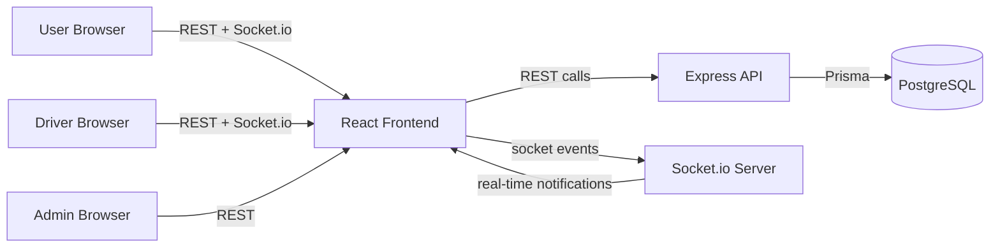
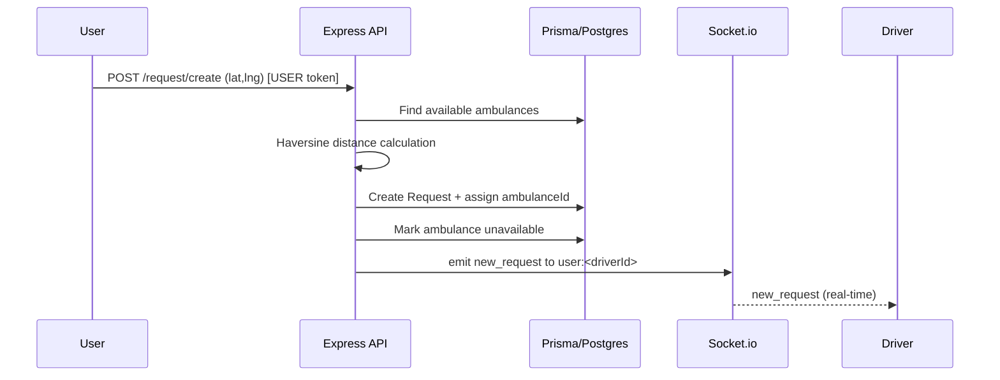
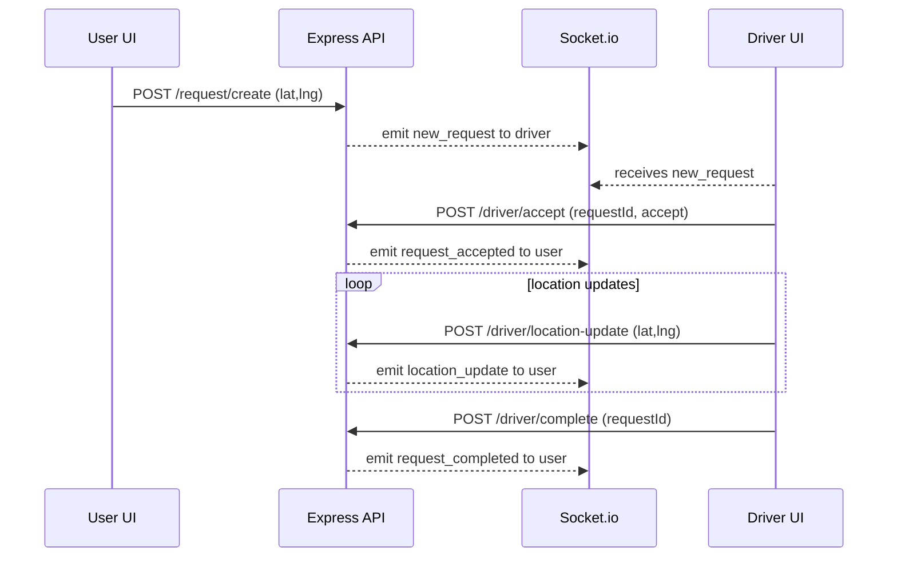

# Unified Ambulance System (UAS) — Project Explanation

## 1. Use Case

Unified Ambulance System is a real-time emergency dispatch platform that simulates how ambulance requests are handled in the real world (similar to ride-sharing dispatch).

Typical scenario:
1. A **User** requests an ambulance from their current location.
2. The backend selects the **nearest available Ambulance/Driver** using distance (Haversine formula).
3. The **Driver** receives the request instantly (real-time notification).
4. The **Driver** accepts the request and continuously sends live location updates.
5. The **User** tracks the moving ambulance on a map until the trip is marked **completed**.
6. An **Admin** can monitor all activities and active requests.

## 2. Roles & Permissions

The system has 3 roles:

1. **USER**
   - Register/Login
   - Create an ambulance request with `lat`/`lng`
   - Track request status: `pending → accepted → completed`
   - View live tracking map
2. **DRIVER**
   - Register/Login as driver
   - Receive incoming ambulance requests in real-time
   - Accept/Reject requests
   - Send live location updates periodically while the request is active
   - Mark request as completed
3. **ADMIN**
   - Admin login
   - View all ambulance requests
   - View all drivers and their ambulances

Security:
- JWT authentication
- Role-based authorization (USER/DRIVER/ADMIN)
- Input validation on backend routes
- Password hashing with `bcryptjs`

## 3. Tech Stack

### Frontend (`client`)
- React (functional components + hooks)
- React Router for navigation
- Axios for API calls
- Socket.io client for real-time updates
- Leaflet + OpenStreetMap for live map visualization
- Styling via simple CSS (`client/src/styles.css`)

### Backend (`server`)
- Node.js + Express
- PostgreSQL database
- Prisma ORM
- JWT authentication
- bcrypt password hashing
- Socket.io for real-time communication
- Haversine distance utility for nearest ambulance selection

## 4. System Architecture (High-Level)

Components:
- **React Frontend** (USER/DRIVER/ADMIN UI)
- **Express Backend API**
- **PostgreSQL + Prisma**
- **Socket.io** for real-time events
- **Leaflet Map** for user tracking visualization

### Architecture diagram (UML / Mermaid)



## 5. Database Design (Prisma Models)

Defined in `server/prisma/schema.prisma`.

Models:
- **User**
  - `id`, `name`, `email`, `password`, `role` (`USER | DRIVER | ADMIN`)
- **Ambulance**
  - `id`, `driverId` (1 driver owns 1 ambulance), `lat`, `lng`, `available`, `status`
- **Request**
  - `id`, `userId`, `lat`, `lng`, `status` (`pending | accepted | completed | rejected`), `ambulanceId`, timestamps
- **LocationUpdate**
  - `id`, `ambulanceId`, `lat`, `lng`, `timestamp`

## 6. Backend API (REST Routes)

Base URL:
- `http://localhost:5000`

### Auth Routes
- `POST /auth/register`
  - Body: `name, email, password, role(optional)`
  - Creates user; if `DRIVER`, also creates an ambulance row.
- `POST /auth/login`
  - Body: `email, password`
  - Returns: `{ token, user }` (JWT + user info)

### User Routes
- `POST /request/create`
  - Protected: USER only
  - Body: `lat, lng`
  - Core dispatch logic:
    1. Fetch all `Ambulance` where `available = true`
    2. Compute distance using **Haversine**
    3. Choose nearest ambulance
    4. Create `Request` with `ambulanceId`
    5. Mark ambulance as unavailable
    6. Emit `new_request` to the chosen driver via Socket.io
- `GET /request/:id`
  - Protected: USER/Admin/Assigned driver
  - Returns request + latest ambulance location (latest location update)

### Driver Routes
- `GET /driver/requests`
  - Protected: DRIVER only
  - Returns:
    - `ambulance`
    - pending/accepted requests for that ambulance
- `POST /driver/accept`
  - Protected: DRIVER only
  - Body: `requestId, action` where `action ∈ ["accept","reject"]`
  - On accept:
    - request status → `accepted`
    - ambulance status → `enroute`, available → false
    - emit `request_accepted` to the user
  - On reject:
    - request status → `rejected`
    - ambulance returns to available/idle
    - emits completion (rejected) to user
- `POST /driver/location-update`
  - Protected: DRIVER only
  - Body: `lat, lng`
  - Updates ambulance coordinates
  - Creates a `LocationUpdate`
  - Emits `location_update` to the assigned user while request is accepted
- `POST /driver/complete`
  - Protected: DRIVER only
  - Body: `requestId`
  - request status → `completed`
  - ambulance returns to available/idle
  - emits `request_completed` to user

### Admin Routes
- `POST /admin/login`
  - Body: `email, password`
  - Only `role === ADMIN` succeeds.
- `GET /admin/requests`
  - ADMIN only: return all requests
- `GET /admin/drivers`
  - ADMIN only: return all drivers with ambulances

## 7. Real-Time Events (Socket.io)

Socket.io is initialized in `server/sockets/index.js`.

Events implemented (as required in `instruction.md`):
- `new_request`
  - Sent to a driver when a user creates a request (after nearest ambulance selection).
- `request_accepted`
  - Sent to the user when the driver accepts the request.
- `location_update`
  - Sent to the user whenever the driver sends `POST /driver/location-update`.
- `request_completed`
  - Sent to the user when the driver completes the request.

Room strategy:
- Driver requests are targeted using a user room: `user:<driverId>`
- User receives updates in: `user:<userId>`

## 8. Dispatch Logic (How Nearest Ambulance is Selected)

Implemented in `server/controllers/requestController.js` using the utility:
- `server/utils/distance.js` → `haversineKm(lat1,lng1,lat2,lng2)`

Flow when creating a request:
1. Fetch all available ambulances
2. For each ambulance compute distance from request coordinates
3. Select the minimum distance ambulance
4. Create request and notify driver via Socket.io (`new_request`)

### Dispatch logic diagram (UML / Mermaid)



## 9. Frontend Workflow (Pages & UI)

Pages created in `client/src/pages`:
- `LandingPage` (`/`)
- `RegisterPage` (`/register`)
- `LoginPage` (`/login`)
- `UserDashboard` (`/user`)
- `RequestAmbulancePage` (`/request`)
- `TrackingPage` (`/track/:id`)
- `DriverDashboard` (`/driver`)
- `AdminLoginPage` (`/admin-login`)
- `AdminDashboard` (`/admin`)

Key UI features:
- Clean responsive cards and list layouts
- Status badges for `pending / accepted / completed / rejected`
- Navbar with logout
- Live tracking map with dynamic ambulance marker updates

### User live tracking flow (UML / Mermaid)



## 10. Setup & Run Instructions

### Prerequisites
- Node.js installed
- PostgreSQL running locally

### Configure env
1. Copy `server/.env.example` → `server/.env`
2. Set:
   - `DATABASE_URL`
   - `JWT_SECRET`
   - `PORT`
   - `CLIENT_ORIGIN`

### Install
From project root:
```bash
npm install
```

### Database migration + seed
```bash
npx prisma migrate dev --schema server/prisma/schema.prisma
npx prisma db seed --schema server/prisma/schema.prisma
```

### Start the app
```bash
npm run dev
```

### URLs
- Client: `http://localhost:3000`
- Server: `http://localhost:5000`

## 11. Seed Data (Demo Accounts)

Seed script is `server/prisma/seed.js`.

Login credentials after `prisma db seed`:
- Admin
  - Email: `admin@uas.local`
  - Password: `Admin@12345`
- Driver 1
  - Email: `driver1@uas.local`
  - Password: `Driver@12345`
- Driver 2
  - Email: `driver2@uas.local`
  - Password: `Driver@12345`
- User 1
  - Email: `user1@uas.local`
  - Password: `User@12345`

## 12. Advantages of This Project

- Real-time dispatch simulation using Socket.io (`new_request`, `location_update`, etc.)
- Nearest ambulance selection using geospatial distance logic (Haversine)
- Role-based dashboards (USER/DRIVER/ADMIN) with protected routes
- Live map tracking using Leaflet + OpenStreetMap
- Clean separation of concerns:
  - Controllers for business logic
  - Routes for request validation and middleware
  - Socket events for live updates
  - Prisma models for persistence

## 13. How to Use / Demo for Faculty

Suggested demonstration flow (10–15 minutes):

### Step 1: Run the project
1. Start PostgreSQL
2. Run:
   - `npm install`
   - `npx prisma migrate dev ...`
   - `npx prisma db seed ...`
   - `npm run dev`

### Step 2: Login as USER
1. Open `http://localhost:3000`
2. Login as `user1@uas.local`
3. Go to **Request Ambulance**
4. Click **Use Current Location** or enter lat/lng
5. Observe:
   - Request created
   - Status moves once driver accepts

### Step 3: Login as DRIVER (Driver 1)
1. Open a new browser tab (or incognito)
2. Login as `driver1@uas.local`
3. Go to Driver Dashboard
4. Observe:
   - Incoming request appears in real-time
5. Click **Accept**
6. Send live location updates:
   - Update lat/lng values and press **Send Update** multiple times
7. Click **Mark Completed**

### Step 4: Watch USER tracking map
Switch back to the USER tab:
- The ambulance marker moves live
- Status updates to `accepted` and then `completed`

### Step 5: Login as ADMIN
1. Login as `admin@uas.local`
2. Open Admin Dashboard:
   - Verify all requests
   - Verify driver list and assigned ambulances

## 14. Presentation Tips (How to Explain It Clearly)

Use this talking structure:
1. Start with the problem: emergency dispatch needs real-time coordination
2. Explain roles and dashboards
3. Explain the dispatch core:
   - user creates request
   - backend finds nearest ambulance using Haversine
   - driver gets instant request via Socket.io
4. Explain live tracking:
   - driver sends location updates
   - backend broadcasts `location_update`
   - user map marker updates
5. End with architecture and security:
   - JWT + role middleware
   - input validation
   - Prisma persistence model

## 15. Useful File Map (Where Things Live)

Backend:
- `server/server.js` — Express app + Socket.io initialization
- `server/prisma/schema.prisma` — database schema
- `server/prisma/seed.js` — seed data
- `server/controllers/*` — auth/request/driver/admin logic
- `server/routes/*` — REST routes + validators
- `server/middleware/*` — JWT auth + role guards
- `server/sockets/index.js` — socket rooms and token auth
- `server/utils/distance.js` — Haversine distance function

Frontend:
- `client/src/App.js` — routing
- `client/src/context/AuthContext.js` — auth state + token persistence
- `client/src/services/api.js` — axios base + Authorization interceptor
- `client/src/services/socket.js` — Socket.io client connection
- `client/src/pages/*` — all UI pages
- `client/src/components/TrackingMap.js` — Leaflet map rendering

